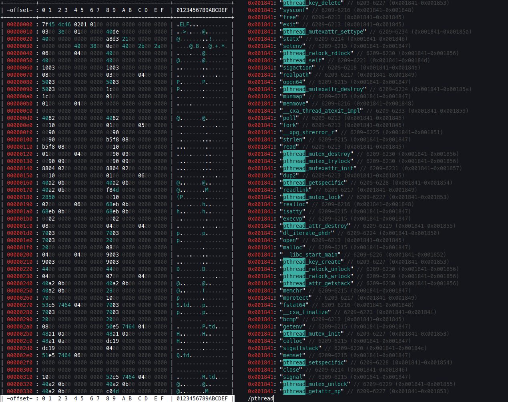

# Hex



A project to create alternate (and more user friendly) versions of existing hex tools.

## Installation

To install as a standalone binary, run the following commands:

```bash
git clone https://github.com/sohomdatta1/hex.git
cd hex
./script/build.sh
```

## Operations

Currently, the following operations are supported:

- `str` - Dumps out readable strings in a particular file
- `dump` - Dumps out a particular file in hexdump format

If a pager is not desired, the `NOPAGER` env variable can be set. If colored output is not desired, the `NOCOLOR` env variable can be set.

## Language

The project is written in Rust, mainly as a way for me to learn the language. I feel like implementing common binary processing tools such as these will be a nice way to get familiar with the basics.
